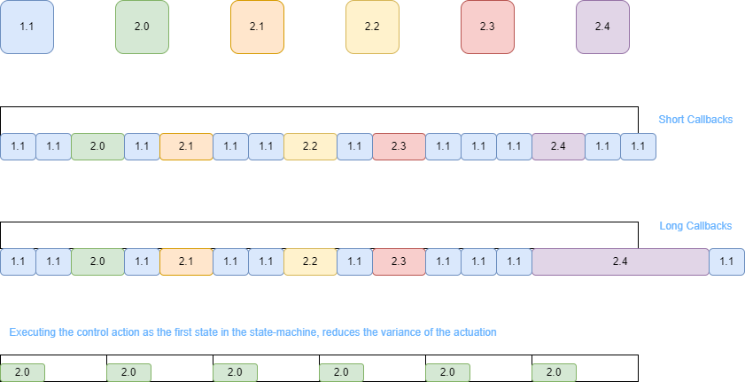

# Real Time controller

Given that realtime systems are usually expensive and dificult to set up we developed a group of applications 
that together provide realtime capabilities, or as close as possible without messing with the kernel of the operating system.
Our system is inspired in the Fast Research Interface provided by KUKA. 
Instead of writing our software with real time in mind, i.e. 
no heap allocation can ever be requested whilst running the program, 
which invalidates most of the cpp standard library, we instead write three processes:

1. Process 1 - serves as a watchdog with a state machine which guarantees that the entire control loop is forced to run at a given frequency. 
2. Process 2 - receives the information from the sensors and writes the control action to the watchdog
3. Process 3 - reads sensors from peripherals in realtime and communicate with watchdog


These three processes communicate between eachother through two mechanism, 
through sockets and through shared memory. 
The shared memory has a specific layout which we use to write the readings of the sensors 
(we want the communication between the processes to be as fast as possible).
The socket communication is used as a syncronization mechanism to control who can access the shared memory at a given moment. 
To simplify the life of developers whilst manuseating the shared memory 
(which is manipulated with directy access the to a giant blob of memory) 
we implemented a compiler which generates classes to read and write into this shared memory. 

# Compiler

The compiler reads a text file, in json format, which describes the layout of the memory. 
Once this process runs two header files are generated which can be used to read and write from the shared memory. 
Lets look at a json file as an example. Assume that you have two periperals, one is a GPS which provides three readings:

1. Velocity - array of three doubles
2. Acceleration - array of three doubles
3. Orientation - array of three doubles

and a camera which provides an image with a fixed size, e.g. a 200x200 image with one byte per pixel. 
One can specify the json describing our fields from the peripherals as 

```json
{
    "shared_memory_name" : "my_custom_name",
    "messages" : [
        {
        "message" : "gps_reading",
        "fields" : [
            {"name" : "counter", "type" : "int", "array" : 1},
            {"name" : "velocity", "type" : "double" , "array" : 3},
            {"name" : "acceleration", "type" : "double" , "array" : 3},
            {"name" : "orientation", "type" : "double" , "array" : 3},
        ]
        },
        {
        "message" : "grayscale_image",
        "fields" : [
            {"name" : "counter", "type" : "int", "array" : 1},
            {"name" : "data", "type" : "bytes", "array" : 40000  }
        ]  
        }
        ]
}
```

Notice that we must specify three descriptors for each field of a message, the name, 
which will be used to generate methods as classes with it, a type, 
which controls how large the underlying type is, and the size which controls if the variable is an array or a scalar in memory. 

From this file, two extra files will be produced, called header_creator.h and header_acessor.h. 
The header_creator.h file contains a class, called SharedMemoryCreator which creates the shared blob of memory, 
called "my_custom_name" with the necessary size to contains both the gps readings and the camera readings, i.e. 
in our example the size of the shared memory is 40000 (size of image in bytes) + 4 (size of counter of camera because an int is four bytes) + 
4 (size of counter of gps because an int is four bytes) + 8 * 3 * 3 
(size of a double in bytes multiplies by the number of scalars in each measurment of the gps multiplied by the number of measurments of the gps) = 40080 bytes in total

The header_acessor.h file contains a class which acesses the shared memory created in the header_creator.h header file. 

Both files contain the extra following classes

1. The gps reading with the proper size
```cpp

struct gps_reading{
    int counter;
	double velocity[3];
	double acceleration[3];
	double orientation[3];
};

```

2. The image reading
```cpp

struct grayscale_image{	
    int counter;
	unsigned char* data = nullptr;
};

```

And both files contain the following methods to both read and write these classes

```cpp
void copy_from_gps_reading_to_shared_memory( unsigned char* memory , const gps_reading & tmp);
void copy_from_shared_memory_to_gps_reading( const unsigned char*  memory,gps_reading & tmp);

void copy_from_grayscale_image_to_shared_memory( unsigned char* memory , const grayscale_image & tmp);
void copy_from_shared_memory_to_grayscale_image( const unsigned char*  memory,grayscale_image & tmp);
```
The names of these methods and classes are extracted directly from the Json file which contains the layout of the memory we wish to manipulate.

The memory layout of these classes on the shared memory is

```
 ---- (gps counter) 4 bytes                           ------|      
 --------  --------  -------- (velocity) 8*3 bytes          |   copy_from_gps_reading_to_shared_memory  | 
 --------  --------  -------- (acceleration) 8*3 bytes      |   copy_from_shared_memory_to_gps_reading  | -> these two methods operate in this portion of the shared memory
 --------  --------  -------- (orientation) 8*3 bytes ______|

 ---- (image counter) 4 bytes                -----|  copy_from_grayscale_image_to_shared_memory |
 ---- ... ----- (image buffer) 40000 bytes   _____|  copy_from_shared_memory_to_grayscale_image | -> these two methods operate in this portion of the shared memory    
```


# Process 2 (Reading sensors)

This process contains simple syncronous loops, and with multithreading, 
we can manage multiple peripherals. Assume that you have N peripherals, 
then process 2 will be composed of N+1 threads, where N threads read the sensors 

```cpp

//Peripheral 1

void read_peripheral_1(std::atomic<double>& reading_1){
    double local_reading_1 = 0.0;
    while(true){
        // custom code to request reading from peripheral 1 (write into local_reading_1)

        // write in atomic fasion into atomic variable reading_1
        reading_1.store(local_reading_1);
    }
}

// ...

//Peripheral N

void read_peripheral_N(std::atomic<double>& reading_N){
    double local_reading_N = 0.0;
    while(true){
        // custom code to request reading from peripheral N (write into local_reading_N)

        // write in atomic fasion into atomic variable reading_N
        reading_N.store(local_reading_N);
    }
}

```

The last N+1 thread controls the frequency at which we read from these variables which should look something like this

```cpp
int main(){
    // First we create the client to communicate with the watchdog
    asio::io_context io_context;
    unsigned int port = 50000;
    asio::ip::tcp::endpoint endpoit(asio::ip::tcp::v4(), port);
    asio::ip::tcp::acceptor acceptor(io_context,endpoit);

    asio::error_code ec;
    asio::ip::tcp::socket client_socket = acceptor.accept();
    if (ec){
        std::cout << "failed to run, terminating....\n";
        std::cout << ec.message() << std::endl;
        return 1;
    };

    // Now we lauch the threads which communicate with each peripheral individually
    // =================================================
    std::atomic<double> ato_reading_1;
    auto callable_1 = [&](){
        read_peripheral_1(ato_reading_1);
    };
    std::thread thread_1{callable_1};

    // ...

    std::atomic<double> ato_reading_N;
    auto callable_N = [&](){
        read_peripheral_N(ato_reading_N);
    };
    std::thread thread_N{callable_N};
    // =================================================

    auto shared_memory = SharedMemoryCreator::create();

    // The watchdog receives a custom message with timing information so we prealocate it here before the loop
    std::array<unsigned char,watchdog_message_size> asio_memory_buffer;
    watchdog_message message; //custom message to send to the watchdog

    for(size_t counter = 0; ; ++counter){
        //receive message from watchdog in a blocking call
        asio::read(client_socket,asio::buffer(asio_memory_buffer),asio::transfer_exactly(watchdog_message_size),ec);
        if(ec){
            std::printf("failed to send information\n terminating....\n");
            io_context.stop();
            break;
        } 

        //copy the atomic reading 1 into the automatically generated reading_1 struct ;
        copy_from_reading_1_to_shared_memory(shared_memory->get_shared_memory_address(),reading_1);
        // ...

        //copy the atomic reading N into the automatically generated reading_N struct ;
        copy_from_reading_N_to_shared_memory(shared_memory->get_shared_memory_address(),reading_N);

        //send message from watchdog in a blocking call
        asio::write(client_socket,asio::buffer(asio_memory_buffer),asio::transfer_exactly(watchdog_message_size),ec);
        if(ec){
            std::printf("failed to send information\n terminating....\n");
            io_context.stop();
            break;
        }
    }
}
```

Obviously the code was simplified to showcase how the application works. For full details please read the code in sensors.cpp to understand all the required mechanisms to guarantee the proper functioning of the system.

# Process 3 (Custom control law)

The third process is supposed to be as simple as possible, i.e. read the sensors and with this information compute the control law to actuate your sensors. This can be achieved through something like 

```cpp
int main(){
    auto shared_memory = SharedMemoryAccessor::create();
    asio::io_context io_context;
    unsigned int port = 50010;
    asio::ip::tcp::endpoint endpoit(asio::ip::tcp::v4(), port);
    asio::ip::tcp::acceptor acceptor(io_content,endpoit);

    asio::error_code ec;
    asio::ip::tcp::socket client_socket = acceptor.accept();
    if (ec){
        std::cout << "failed to run, terminating....\n";
        std::cout << ec.message() << std::endl;
        return 1;
    };

    reading_1 peripheral_1;
    // ...
    reading_N peripheral_N;

    while(!io_context.stopped()){
        asio::read(client_socket, asio::buffer(asio_memory_buffer), asio::transfer_exactly(watchdog_message_size), ec);
        if (ec) {
            std::printf("failed to read information\n terminating....\n");
            io_content.stop();
        }

        copy_from_shared_memory_to_reading_1(shared_memory->get_shared_memory_address(),peripheral_1);
        // ... 
        copy_from_shared_memory_to_reading_N(shared_memory->get_shared_memory_address(),peripheral_N);

        //compute control law
        // ...

        //write control law into asio_memory_buffer

        asio::write(client_socket,asio::buffer(asio_memory_buffer),asio::transfer_exactly(watchdog_message_size),ec);
        if(ec){
            std::printf("failed to send control action\n terminating....\n");
            io_content.stop();
        }
    }
}
```

If you understood process 2, this code should be self explanatory

# Process 1 (Watchdog)

The last, and the most important process across this entire code base is the watchdog, this is the crux of the mecanism we propose to control the robot in realtime. Because we have slaves which are dedicated to read and compute the control law, our only concern left is the mechanism which guarantees that reading and writing happens in a given timeslot. 

The wathdog achieves this through ASIO (Asyncronous Input and Output). We read messages and write messages in an assyncrounous fashion, meaning that our operations are nonblocking. Thus we can do the following:

```
1.1. Start a timer with a deadline in P milliseconds    | 2.0. Write to actuators with desired voltages (or whatever the output is)
                                                        | 2.1. Submit a request to write a message to process 2 requesting the readinng of the sensors
                                                        | 2.2. Read the acknolegement from process 2 that all sensors have been read
                                                        | 2.3. Submit a request to process 3 to compute our control low
                                                        | 2.4. Read the acknolegement from process 3 that the control law has been executed and store the control action for the next control loop               
```

The previous operatorion are NOT being executed in multiple threads, but instead one thread. If the timer expires before 2.4. is executed, then the system has failed to execute in the available timeslot. To check the timer, we pool a clock internally. Because the callbacks 2.x are very very short in time duration, we spend most of our time dedicated to checking if we have crossed the deadline. With this mechanism 
we have tested it with an oscilascole and we achieved a system with a maximum delay of 5 microseconds. 
Although the system works in linux with the desired time properties, that is not the case on windows, where the kernel call to the timer is not as strict as the linux one. 

The code of the watchdog writes 

```cpp
struct Client;
void safety_shutdown(Client* control_law);

struct Client{
  asio::high_resolution_timer timer;
  bool data_sent = false;
  std::array<unsigned char,watchdog_message_size> allocated_memory_buffer;
  asio::io_context& context;
  asio::ip::tcp::socket sensor_socket_;
  asio::ip::tcp::socket client_socket_;
  watchdog_message message;

  explicit Client(asio::io_context& in_context,
                    asio::ip::tcp::socket&& sensor_socket,
                    asio::ip::tcp::socket&& client_socket
                                                      ) : context{in_context} ,
                                                         sensor_socket_{std::move(sensor_socket)},
                                                        client_socket_{ std::move(client_socket) },
                                                         timer{in_context}{}

  Client(const Client & copyclient) = delete;

  Client(Client && client) = delete;

  ~Client(){
    timer.cancel();
    safety_shutdown(this);
  }
};

void safety_shutdown(Client* control_law){
   std::cout << "terminating with safety stop because something went wrong (shutting down controller)" << std::endl;
   std::cout.flush();
}

void write_control(Client& ref);
void request_sensors_acquistion(Client& ref);
void read_sensors_acknowledgment(Client& ref);
void warn_client_of_readings(Client& ref);
void read_client_acknowledgment(Client& ref);
```

Where the Client class contains a method called safety shutdown which is called when the deadline of the timer is violated. In the safety_shutdown method you can write your custom safety handler, e.g. slowly bringing your autonomous device to a standstill. 

To clarify WHY the system works, look at the following table



If the durantion of the callback that processes the incoming and outgoing messages to process 2 and 3, the timer will be violated by shorter durations, whilst longer durations are equivalent to larger variances in the expiration of the timer. The process of actually receiving the assyncronous messages is dealt by the kernel of the operating system. This is still not hard realtime because process 1 can be stopped temporarily by the kernel of the operating system to execute another process. To avoid this problem one can isolate a core of the hardware just to execute the Watchdog, forbiding the operating system from running anything in our reserved core. This should bring the system to something close to hard realtime. 